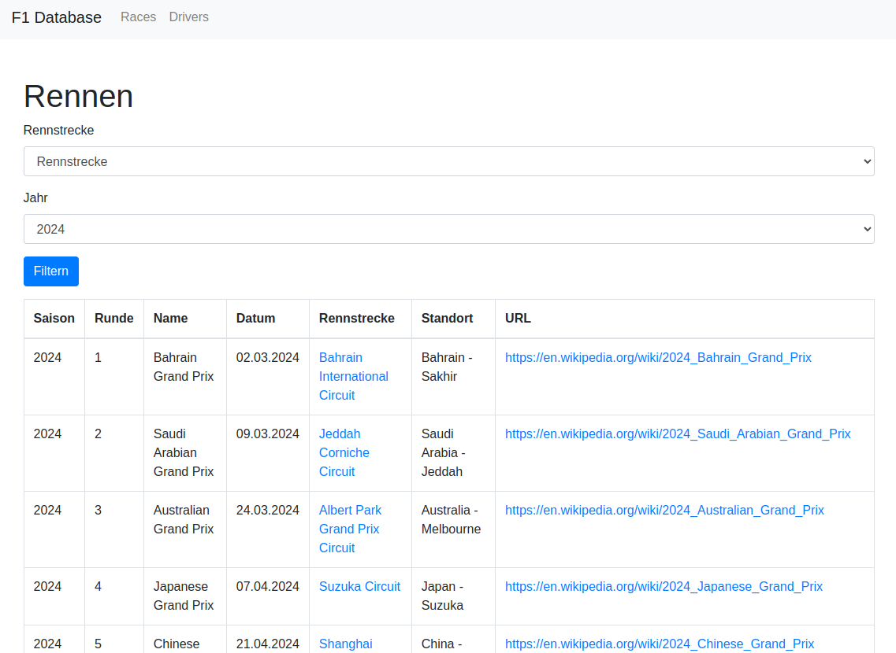

# Formula 1 Verwaltungsanwendung

Diese Anwendung verwaltet Daten der Formel 1, aktuell nur die Fahrer und Rennen.

## Verwendung

### Voraussetzungen

Stellen Sie sicher, dass Sie die folgenden Voraussetzungen erfüllen, bevor Sie die Anwendung starten:

- Docker installiert und konfiguriert
- Git (optional, wenn Sie das Repository klonen möchten)

### Setup

1. **Repository klonen (optional):**

   ```bash
   git clone <repository-url>
   cd <repository-name>
   ```

2. **Docker-Container erstellen und starten:**

    Führen Sie die folgenden Befehle aus, um die Docker-Container für die Anwendung zu erstellen und zu starten:

    ```bash
    docker-compose up -d --build
    ```

    Datenbankmigrationen werden automatisch beim Starten der Laravel Anwendung ausgeführt.

3. **Verwendung der Anwendung**

    #### Daten importieren
    
    Um die Daten von der Ergast API zu holen und zu importieren stehen Ihnen folgende Laravel Command zur Verfügung (Wir gehen von Docker V2 aus):
    
    #### Dieser Befehl importiert alle Fahrer Daten von der API:
    ```bash
    docker compose exec app php artisan import:drivers
    ```
    
    #### Dieser Befehl importiert alle Hersteller Daten von der API:
    ```bash
    docker compose exec app php artisan import:constructors
    ```

    #### Dieser Befehl importiert alle Rennstrecken von der API:
    ```bash
    docker compose exec app php artisan import:circuits
    ```

    #### Dieser Befehl importiert alle Rennen von der API:
    ```bash
    docker compose exec app php artisan import:races
    ```

    #### Dieser Befehl importiert alle Saisons von der API:
    ```bash
    docker compose exec app php artisan import:seasons
    ```

    #### Dieser Befehl importiert alle Ergebnisse von der API (dauert sehr lange):
    ```bash
    docker compose exec app php artisan import:results
    ```

    #### Dieser Befehl führt alle Imports in geordneter Reihenfolge aus:
    ```bash
    docker compose exec app php artisan import:command
    ```

Anschließend navigiert man unter http://localhost:8000 im Browser um die Anwendung aufzurufen.

Bisher findet man in der Navigation die Routen für die Rennen und die Fahrer.

Beide Tabellen sind sortiert und zeigen je 10 Ergebnisse pro Seite an, zusätzlich kann man die Ergebnisse mit einigen Vorgaben filtern.


